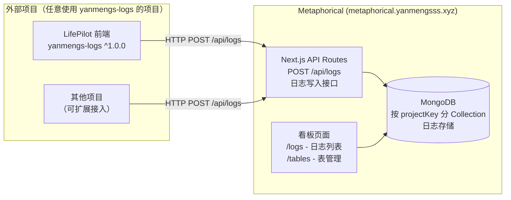
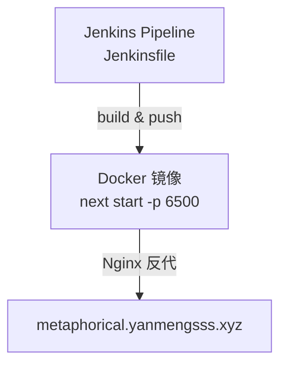

# Metaphorical — 日志监控看板架构说明


> **生产域名**：`https://metaphorical.yanmengsss.xyz/`  
> **技术栈**：Next.js 16 · React 19 · Mongoose · shadcn/ui · TailwindCSS  
> **部署方式**：Jenkins + Docker (`next start -p 6500`)

---

## 一、项目定位

Metaphorical 是整个系统的**集中式日志监控看板**，接收来自各项目通过 `yanmengs-logs` SDK 上报的运行日志，并提供可视化查询界面。开发者/运维人员可按项目、时间、日志级别等维度筛选查看。

---

## 二、核心功能

- **日志接收 API**：接受各项目 HTTP POST 上报的结构化日志
- **日志存储**：持久化到 MongoDB（按表（项目）隔离）
- **可视化看板**：分页查看、多维筛选、日志详情展开
- **表管理**：按 `projectKey` 创建独立日志表（Collection）
- **SDK 配套**：与 `yanmengs-logs` npm 包配套，支持 `projectKey + tableName` 初始化

---

## 三、系统架构



---

## 四、API 接口

| 路由 | 方法 | 功能 |
|------|------|------|
| `/api/logs` | POST | 接收日志上报（`projectKey`, `tableName`, `level`, `message`, `data`） |
| `/api/logs` | GET | 查询日志列表（分页、过滤） |
| `/api/tables` | GET | 获取所有已注册的日志表 |
| `/api/tables` | POST | 创建新日志表（项目注册） |
| `/api/tables/[id]` | PUT | 编辑日志表配置 |

---

## 五、日志数据结构

```typescript
interface LogEntry {
  _id: string;
  projectKey: string;   // 项目标识
  tableName: string;    // 日志表名（对应 MongoDB Collection）
  level: 'info' | 'warn' | 'error' | 'debug';
  message: string;      // 日志内容
  data?: Record<string, unknown>;  // 附加数据
  timestamp: Date;      // 上报时间（自动注入）
  ip?: string;          // 客户端 IP（可选）
}
```

---

## 六、yanmengs-logs SDK 集成

`yanmengs-logs` 已升级为正式 npm 包（`^1.0.0`），任意项目可直接安装使用：

```bash
npm install yanmengs-logs
```

```typescript
import { createLogger } from 'yanmengs-logs';

// 初始化（指定目标 Metaphorical 实例、项目 Key 和表名）
const logger = createLogger({
  projectKey: 'my-project',
  tableName: 'prod_logs',
  endpoint: 'https://metaphorical.yanmengsss.xyz/api/logs'
});

// 使用
logger.info('user_login', { userId: '123' });
logger.error('api_error', { error: 'timeout', url: '/api/chat' });
```

---

## 七、页面路由

| 路由 | 功能 |
|------|------|
| `/` | 首页 / 项目概览 |
| `/tables` | 日志表管理（创建/查看/编辑） |
| `/tables/[id]/logs` | 具体表的日志列表（分页、筛选） |
| `/dashboard` | 汇总数据看板（日志量统计等） |

---

## 八、技术栈详情

| 分层 | 技术 | 版本 |
|------|------|------|
| 框架 | Next.js | 16.1.6 |
| UI | shadcn/ui, Radix UI, TailwindCSS | latest |
| 数据库 | MongoDB（Mongoose） | ^9.2.3 |
| 缓存 | Redis（ioredis） | ^5.10.0 |
| 表单 | react-hook-form, zod | latest |
| 时间 | date-fns | ^4.1.0 |

---

## 九、部署信息

| 项目 | 命令 | 端口 | 域名 |
|------|------|------|------|
| Metaphorical | `next build && next start -p 6500` | 6500 | `metaphorical.yanmengsss.xyz` |



- **CI/CD**：Jenkins Pipeline（`Jenkinsfile` 已存在于项目根目录）
- **容器**：Docker（`Dockerfile` 已存在于项目根目录）
- **MongoDB**：`45.207.220.25:27017`
